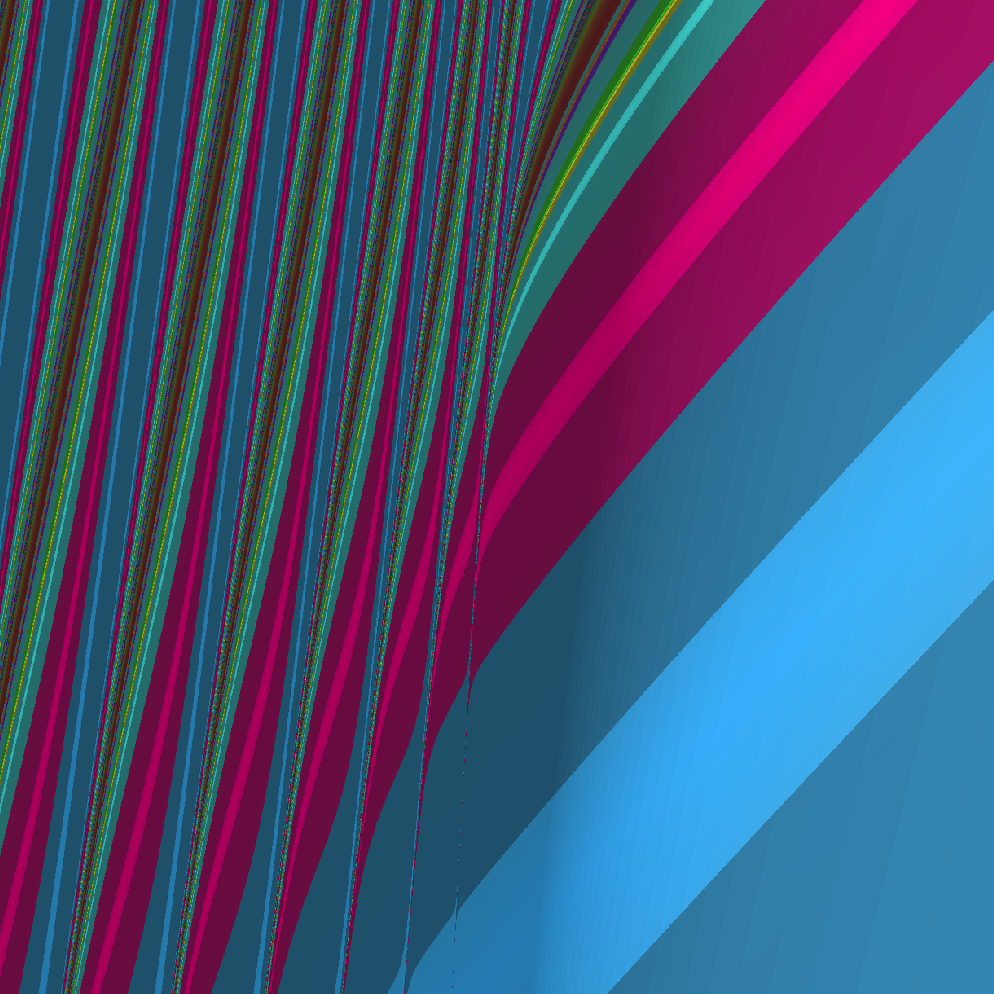

# The Constantbrot

**A fractal explorer for the Conservative Matrix Field (CMF) — mapping the topology of mathematical constants.**



Each pixel is a complete mathematical experiment. Parameters (A, B) are fed into a polynomial continued fraction derived from the Conservative Matrix Field structure, and colored by what fundamental constant — if any — emerges.

Pink regions converge to ζ(3). Blue regions to ln(2)-adjacent values. The boundaries between them are fractal, infinitely complex, and home to constants that may have never been named.

## What is a Conservative Matrix Field?

In 2023, Ofir David and collaborators at the Technion (as part of the [Ramanujan Machine](https://www.ramanujanmachine.com/) project) introduced the Conservative Matrix Field — an algebraic structure that unifies thousands of formulas for fundamental constants like π, e, ln(2), and ζ(3) under a single framework.

A CMF consists of two polynomial matrices M_X(x,y) and M_Y(x,y) satisfying a conservativeness condition:

```
M_Y(x,y) · M_X(x, y+1) = M_X(x,y) · M_Y(x+1, y)
```

This is analogous to a conservative vector field in physics — the "work" (matrix product) along any path through the integer lattice depends only on the endpoints, not the route. Each horizontal line through this lattice produces a polynomial continued fraction that converges to a fundamental constant.

The remarkable discovery: different constants emerge from the same algebraic machine, differing only in the degree and coefficients of the generating polynomials:

| Constant | Conjugate polynomials | Degree |
|----------|----------------------|--------|
| ln(2) | f(x,y) = x+y, f̄(x,y) = x−y | 1 |
| e | f(x,y) = x+y, f̄(x,y) = 1 | 1 |
| π | f(x,y) = 1+2(x+y), f̄(x,y) = y−x | 1 |
| ζ(2) = π²/6 | f(x,y) = 2x²+2xy+y², f̄(x,y) = −f(−x,y) | 2 |
| ζ(3) | f(x,y) = x³+2x²y+2xy²+y³, f̄(x,y) = f(−x,y) | 3 |

In March 2025, the Ramanujan Machine team showed that **94% of all known formulas for π** can be traced back to CMF structures. The paper "From Euler to AI: Unifying Formulas for Mathematical Constants" was presented at NeurIPS 2025.

## What this project does

This repo contains two interactive tools built in React:

### 1. CMF Explorer

[[demo](cmf-explorer.html)]

An interactive tool that lets you select a fundamental constant and watch its polynomial continued fraction converge in real-time. Features:

- **Five constants**: ζ(3), π, e, ζ(2), ln(2)
- **Multiple lattice lines**: For ζ(3), switch between y=1, y=2, y=3 to see different formulas converge to the same constant at different speeds
- **Live convergence graph** with animated rendering
- **Step-by-step table** showing each convergent and error
- **Adjustable parameters**: number of terms, lattice row

### 2. The Constantbrot

[[demo](cmf-fractal.html)]

A Mandelbrot-style fractal explorer that maps the CMF parameter space. For each pixel at coordinates (A, B):

```
a(k) = k³ + (k+1)³ + A·k² + B·k + C
b(k) = −k⁶
```

The continued fraction `a₀ + K(b(k)/a(k))` is evaluated and the pixel is colored by:

- **What constant it converges to** (hue) — known constants get signature colors
- **How fast it converges** (brightness)
- **Whether it diverges** (dark/black)

Features:
- Click to zoom into fractal boundaries
- Adjust the C parameter to explore different cross-sections
- Hover to inspect individual pixel values
- Adjustable iteration depth and resolution

## The mathematics

### Polynomial Continued Fractions

A generalized continued fraction has the form:

```
a₀ + b₁/(a₁ + b₂/(a₂ + b₃/(a₃ + ...)))
```

When a(k) and b(k) are polynomials in k, this is a Polynomial Continued Fraction (PCF). The CMF construction generates PCFs where:

- `b(k) = f(k,0) · f̄(k,0)` (product of conjugate polynomials at y=0)
- `a(k) = f(k+1, y₀−1) − f̄(k, y₀−1)` (difference at lattice row y₀)

### The fractal connection

The Constantbrot perturbs the ζ(3) continued fraction with polynomial corrections parameterized by (A, B, C). Standard CMF lattice lines correspond to specific parameter values (A=0, B=4m(m−1), C=2m(m−1) for integer m). Off-lattice parameters produce continued fractions that still converge — but to values that don't match known constants.

The boundary between convergence and divergence in this parameter space exhibits fractal structure, analogous to the Mandelbrot set boundary for the iteration z → z² + c.

### Unidentified constants

During development, we swept the parameter space and found **390 converging continued fractions** whose values could not be matched to any known mathematical constant or simple algebraic combination thereof. These were tested against π, e, ln(2), ln(3), ζ(2)–ζ(5), Catalan's G, Euler's γ, and all pairwise combinations.

These "mystery constants" live at off-lattice parameter values — they emerge from the CMF structure but may represent genuinely new mathematical objects. Definitive identification would require multi-precision arithmetic and the PSLQ algorithm.

## References

- David, O. (2023). [The Conservative Matrix Field](https://arxiv.org/abs/2303.09318). arXiv:2303.09318.
- Elimelech, R., David, O., et al. (2024). [Algorithm-assisted Discovery of an Intrinsic Order Among Mathematical Constants](https://www.pnas.org/doi/10.1073/pnas.2321440121). PNAS 121.
- Raayoni, G., et al. (2021). [Generating conjectures on fundamental constants with the Ramanujan Machine](https://www.nature.com/articles/s41586-021-03229-4). Nature 590.
- Raz, T., et al. (2025). From Euler to AI: Unifying Formulas for Mathematical Constants. NeurIPS 2025.
- Weinbaum, S., et al. (2025). [On Conservative Matrix Fields: Continuous Asymptotics and Arithmetic](https://arxiv.org/abs/2507.08138). arXiv:2507.08138.
- [The Ramanujan Machine Project](https://www.ramanujanmachine.com/)
- [Ramanujan Machine Tools (GitHub)](https://github.com/RamanujanMachine/ramanujantools)

## Contributing

This is an open exploration. Ideas for contributions:

- **Arbitrary-precision rendering** using a BigDecimal library to push the fractal zoom deeper
- **PSLQ integration** to auto-identify constants at hover points
- **Additional CMF families** — degree-2 and degree-3 parameter spaces
- **3D visualization** of the (A, B, C) parameter volume
- **Diagonal lattice paths** through the CMF grid (not just horizontal lines)
- **WebGPU acceleration** for real-time high-resolution rendering

## License

MIT — do whatever you want with it.

---

*Built on Pi Day 2026. Inspired by a conversation about how two polynomials can generate the fundamental constants of mathematics.*